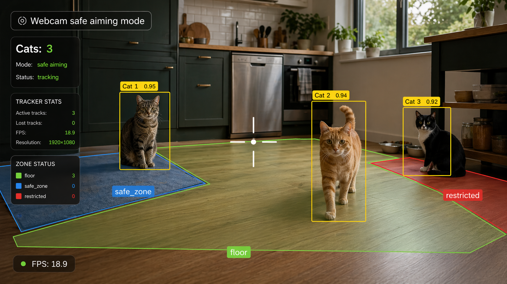
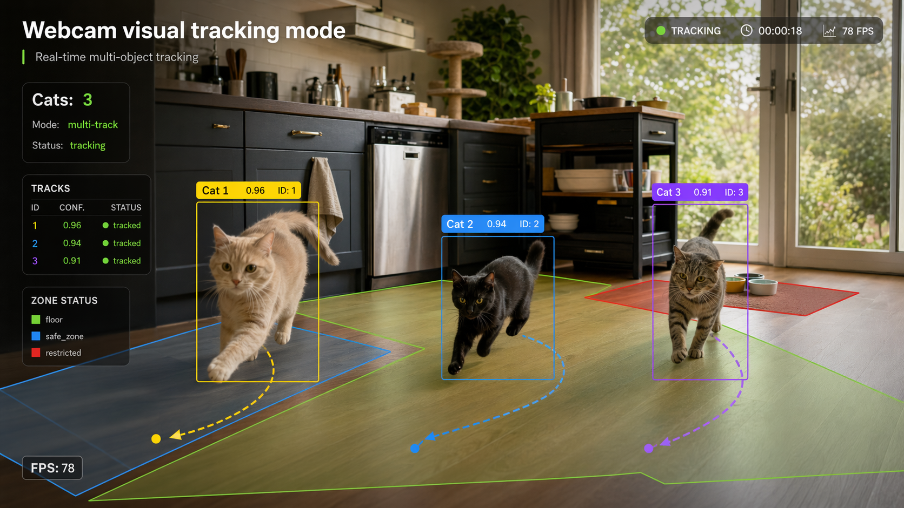
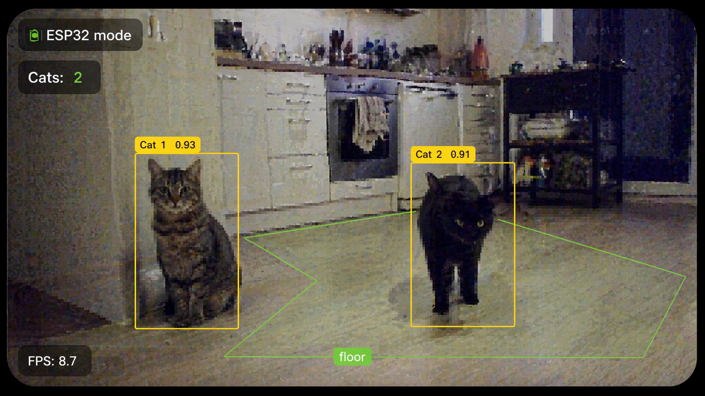
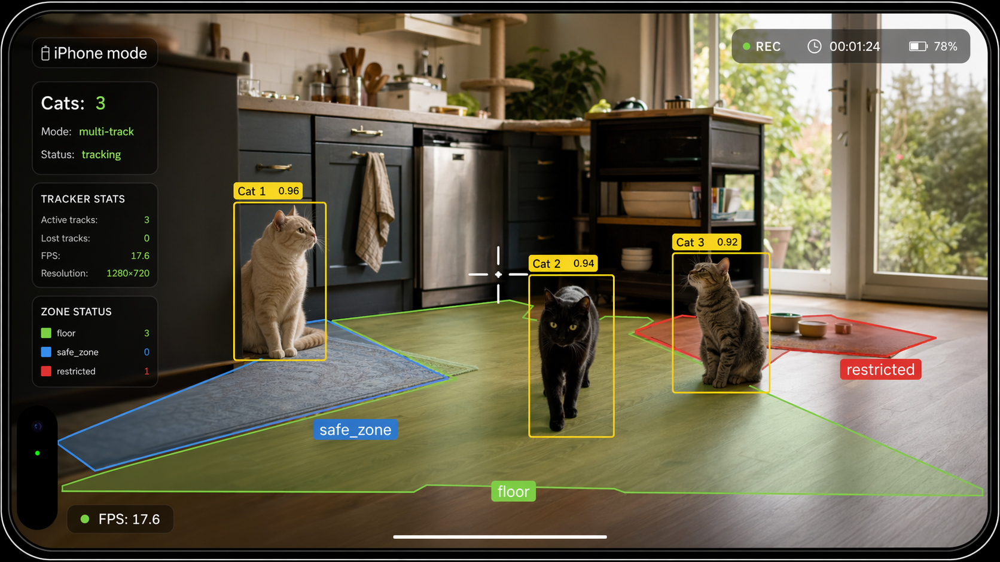
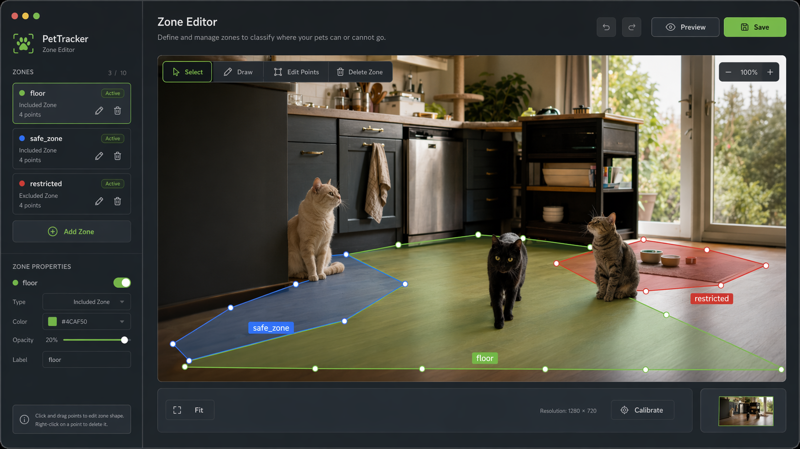

# TrackingCat

TrackingCat is a local cat detection and tracking system with zone-based alerts.

It runs on Ubuntu and supports three camera sources:
- built-in or USB webcam
- ESP32 Wi-Fi snapshot camera
- iPhone running IP Camera Lite (MJPEG over HTTP)

The project is tuned for CPU inference and is intended for real-time household monitoring, not cloud deployment.

> Note: TrackingCat is still under active development. The screenshots in this README are illustrative references, and the current UI, overlays, colors, and on-screen details may differ from the examples shown here.

## Features

- cat detection with YOLO models
- single or multi-cat tracking
- zone editor with per-camera saved layouts
- restricted / floor zone logic
- alert sound playback
- alert video recording with metadata
- support for multiple camera configs
- CPU-friendly presets

## Camera modes

### 1. Webcam safe aiming mode
Config: `configs/webcam_aiming_safe.yaml`

Use when you want the main webcam profile with practical defaults for aiming and alert zones.

Run:

```bash
cd ~/PycharmProjects/TrackingCatWIFI
./run_camera.sh webcam-safe
```

### 2. Webcam visual tracking mode
Config: `configs/webcam_visual_tracking.yaml`

Use when you want richer visual tracking feedback.

Run:

```bash
cd ~/PycharmProjects/TrackingCatWIFI
./run_camera.sh webcam-visual
```

### 3. ESP32 Wi-Fi camera
Config: `configs/esp32_wifi.yaml`

This mode reads JPEG snapshots from the ESP32 UVC Wi-Fi camera.

Expected endpoint:
- `http://192.168.8.140/snapshot.jpg`

Run:

```bash
cd ~/PycharmProjects/TrackingCatWIFI
./run_camera.sh esp32
```

### 4. iPhone via IP Camera Lite
Config: `configs/iphone_ipcamera.yaml`

This mode reads the live MJPEG stream from IP Camera Lite.

Current expected endpoint:
- `http://192.168.8.181:8081/video`

Run:

```bash
cd ~/PycharmProjects/TrackingCatWIFI
./run_camera.sh iphone
```

### iPad
```bash
cd ~/PycharmProjects/TrackingCatWIFI
./run_camera.sh ipad
```

### iPad PanTilt manual aiming
```bash
cd ~/PycharmProjects/TrackingCatWIFI
./run_camera.sh pantilt
```

This mode keeps cat detection off for now and turns the app into a live aiming console:
- uses the iPad stream as the camera
- draws on-screen D-pad buttons for pan / tilt
- supports fine / normal / coarse step sizes
- controls the ESP32 over Wi-Fi
- lets you toggle the laser while you calibrate aim

If the iPhone IP changes, update `source.stream_url` in `configs/iphone_ipcamera.yaml`.

## Quick mode guide

| Mode | Best for | Tradeoff |
| --- | --- | --- |
| Webcam safe aiming | Accurate aiming, alert tuning, careful monitoring | More CPU load, less visual smoothness |
| Webcam visual tracking | Smooth live viewing | Slightly more tracker-driven behavior |
| ESP32 snapshot | Simple remote camera over Wi-Fi | Very low resolution |
| iPhone IP Camera Lite | Best image quality and widest view | Higher bandwidth and possible latency |
| iPad PanTilt manual aiming | Live aiming + servo calibration before automation | Manual only, no cat auto-targeting yet |

## Screenshots

### Webcam safe aiming mode


### Webcam visual tracking mode


### ESP32 snapshot mode


### iPhone IP Camera Lite mode


### Zone Editor


## Zone editor

Each camera mode keeps its own config, so zones are independent between webcam, ESP32, and iPhone.

Examples:

### Webcam safe
```bash
cd ~/PycharmProjects/TrackingCatWIFI
.venv/bin/python -m app.main --config configs/webcam_aiming_safe.yaml --zone-editor true --device cpu
```

### Webcam visual
```bash
cd ~/PycharmProjects/TrackingCatWIFI
.venv/bin/python -m app.main --config configs/webcam_visual_tracking.yaml --zone-editor true --device cpu
```

### ESP32
```bash
cd ~/PycharmProjects/TrackingCatWIFI
.venv/bin/python -m app.main --config configs/esp32_wifi.yaml --zone-editor true --device cpu
```

### iPhone
```bash
cd ~/PycharmProjects/TrackingCatWIFI
.venv/bin/python -m app.main --config configs/iphone_ipcamera.yaml --zone-editor true --device cpu
```

Zone Editor controls:

- Left mouse: select zone or start rectangle
- Right mouse: finish polygon
- `r`: rectangle mode
- `p`: polygon mode
- `f`: floor zone type
- `s`: surface zone type
- `x`: restricted zone type
- `n`: edit next zone name
- `u`: undo last polygon point, or remove selected/last zone
- `c`: clear current draft
- `d`: delete selected zone
- `w`: save zones to YAML
- `l`: reload zones from YAML
- `q`: quit editor

Zone types and what they do:

- `floor`
  - normal allowed area where the cat can walk
  - used as the safe baseline state
  - if `surface_alert.trigger_only_from_floor: true`, then alerts are triggered specifically when the cat moves from `floor` into a dangerous zone
  - no alert is produced just for being on floor

- `surface`
  - raised surface like table, kitchen counter, shelf, desk, bed edge, etc.
  - when the cat enters this zone, the app can create a surface-entry event
  - if alerts are enabled for this config, the app plays the alert sound and shows the overlay warning message
  - best for places where you want to know that the cat climbed somewhere, but it is not the highest-priority danger zone

- `restricted`
  - strict forbidden zone
  - works like a surface alert zone too, but is treated as higher priority than normal `surface`
  - if a cat is inside it, alert logic can trigger the same entry event, and continuous alert mode is usually aimed at this type
  - with the current default configs, continuous sound while the cat remains inside the zone is mainly intended for `restricted` zones

How the app reacts in practice:

- cat on `floor` -> tracking only, no alert
- cat moves from `floor` to `surface` -> entry alert can fire
- cat moves from `floor` or unknown area to `restricted` -> entry alert can fire
- cat stays inside a `restricted` zone -> continuous alert sound may keep playing if enabled in that camera config
- if zones overlap, `restricted` has priority over `surface`, and `surface` has priority over `floor`

## Configuration overview

Main sections in each YAML config:

- `source` , camera source and reconnect behavior
- `detector` , model and confidence thresholds
- `overlay` , crosshair, labels, FPS, counters
- `tracking` , multi-cat and track retention behavior
- `scene_zones` , floor / restricted zones
- `surface_alert` , alert trigger logic
- `alert_recording` , saved alert clips and metadata
- `resize` , optional post-capture resize

## Recommended current usage

### 1. Webcam safe aiming mode
- best when you want the most reliable target position
- stronger choice for tuning zones, alerts, and crosshair placement
- heavier than visual mode because it re-checks detections more often

### 2. Webcam visual tracking mode
- best when you want smoother live viewing
- lighter and more fluid during normal tracking
- can be slightly less strict than safe mode during fast motion or tricky frames

### 3. ESP32 snapshot camera
- useful when you need a lightweight remote camera
- current camera is low resolution, so expect lower accuracy than webcam or iPhone
- best for basic presence and zone monitoring

### 4. iPhone IP Camera Lite
- best image quality of the current setups
- currently preferred with wide camera, 4K, 30 FPS at source
- actual TrackingCat processing FPS may be much lower, which is normal on CPU

## Installation

Create and use a Python virtual environment, then install dependencies:

```bash
cd ~/PycharmProjects/TrackingCatWIFI
python3 -m venv .venv
. .venv/bin/activate
pip install -r requirements.txt
```

## Tests

Run tests with:

```bash
cd ~/PycharmProjects/TrackingCatWIFI
.venv/bin/python -m pytest -q
```

## Project structure

```text
app/        application code
configs/    camera-specific YAML configs
tests/      test suite
sounds/     alert sounds
run_camera.sh
README.md
```

## Notes

- This repository intentionally does not include local virtual environments, logs, alert recordings, backups, certificates, or model weights.
- Large model files such as `*.pt` are excluded from git.
- The project is designed for local use on the Ubuntu machine.


## ESP32 PanTilt firmware

Firmware sketch: `firmware/esp32_pantilt/esp32_pantilt.ino`

What it does:
- exposes HTTP control endpoints for pan / tilt / laser
- stores Wi-Fi and GPIO settings in flash
- starts STA mode when Wi-Fi is configured
- falls back to AP setup mode when Wi-Fi is missing or fails

Initial setup after flash:
1. Power the ESP32 over USB
2. If it is not on Wi-Fi yet, connect to the AP `TrackingCatPanTilt-xxxxxx`
3. Open `http://192.168.4.1`
4. Enter Wi-Fi SSID/password and, if needed, your actual GPIO pins
5. Reboot the board
6. Run `./run_camera.sh pantilt`
